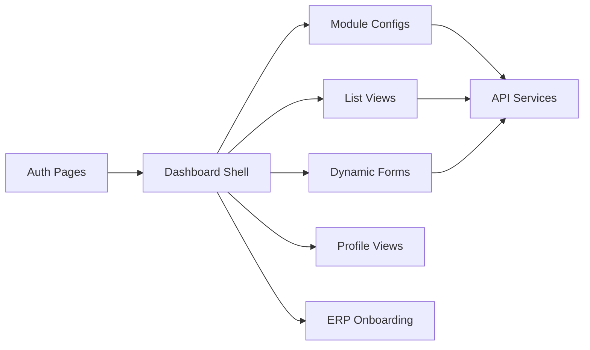
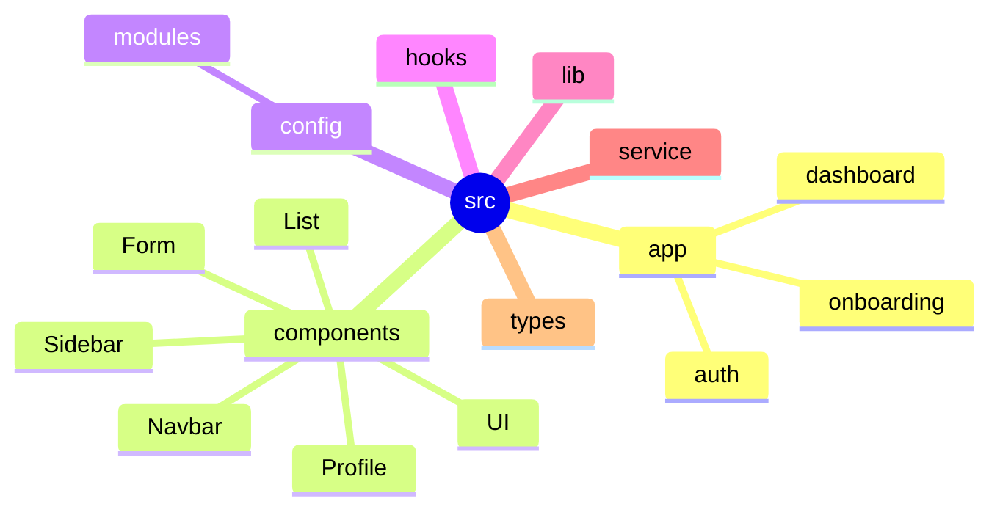
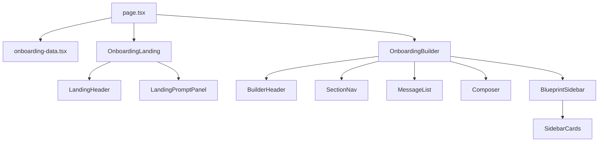

# CRM Dashboard

<p align="center">
  
</p>

<p align="center">
  <strong>Modern CRM dashboard built with Next.js, TypeScript, Tailwind CSS, and reusable business modules.</strong>
</p>

<p align="center">
  
  
  
  
</p>

## Overview

This project is a CRM/ERP-style admin dashboard for managing business data, modules, forms, records, user workflows, and onboarding flows. It includes reusable list views, form engines, profile components, authentication screens, and a guided ERP onboarding experience.



## Highlights

- Next.js app router structure with TypeScript.
- Config-driven dashboard modules.
- Reusable form, list, navbar, sidebar, and profile components.
- ERP onboarding flow split into focused components.
- Tailwind-powered responsive UI.
- API/service layer for backend integration.

## Project Structure



## Getting Started

Install dependencies and start the local development server:

```bash
npm install
npm run dev
```

Open the app at:

```text
http://localhost:3000
```

## Scripts

| Command | Purpose |
| --- | --- |
| `npm run dev` | Start the development server |
| `npm run build` | Build the production app |
| `npm run start` | Run the production server |
| `npm run lint` | Run ESLint |

## Tech Stack

| Area | Tools |
| --- | --- |
| Framework | Next.js, React |
| Language | TypeScript |
| Styling | Tailwind CSS |
| Data/UI | TanStack Query, TanStack Table, Radix UI |
| Forms | React Hook Form, Zod |
| Motion | Framer Motion |
| Icons | Lucide React |

## Onboarding Flow

The ERP onboarding route is organized into data, page orchestration, landing UI, builder UI, and sidebar cards.


